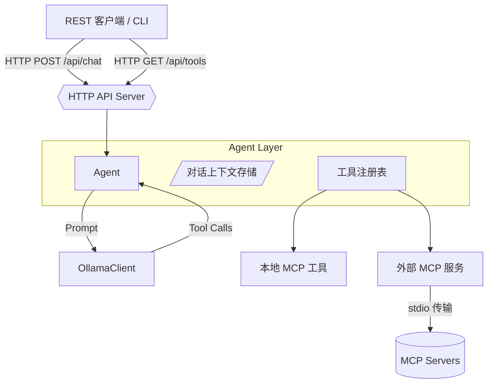
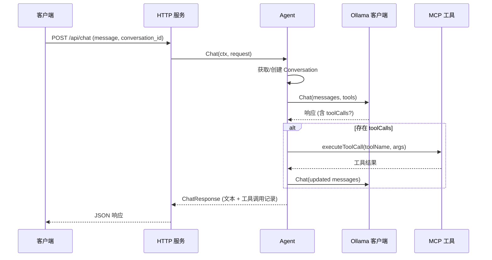

# AIAgent 设计概览

## 项目目标

- 提供一个用 Go 编写的轻量级智能体参考实现，演示如何在本地快速落地工具增强型 AI Agent。
- 说明如何将 Ollama 托管的本地大模型与 Model Context Protocol（MCP）工具生态进行桥接。
- 打造可扩展的工具注册与管理框架，方便接入更多本地或远端能力。

## 整体架构

## 核心运行概念

- **Agent**：负责封装对话循环，调用 Ollama 推理，并调度工具执行。
- **Conversation**：线程安全的对话存储，确保同一会话 ID 拥有连续上下文。
- **Tool Registry**：统一管理本地和外部 MCP 工具及其执行器，实现来源无感知的调用。
- **MCP 客户端管理器**：根据配置启动外部 MCP 服务器，收集其工具列表并转换为 Ollama 能理解的格式。
- **Ollama 客户端**：基于官方 SDK 的薄封装，负责聊天接口和健康检查。
- **HTTP API Server**：暴露 `/api/chat`、`/api/tools`、`/health`，将请求转化为 Agent 调用。

## 请求生命周期

## 配置模型

- `config.yaml` 控制服务名称、HTTP 监听地址以及日志级别。
- `ollama` 节定义模型、超时、重试策略等参数。
- `mcp_servers` 中每个条目描述一个 MCP Server 的启动命令、参数、环境变量及是否启用。
- 默认配置内置文件系统 MCP Server，便于快速体验工具链路。

## 工具接入流程

1. `Agent.Start` 初始化 Ollama 客户端并执行 `Ping` 验证连通性。
2. 若配置中存在启用的 MCP Server，创建 `MCPClient` 并通过 stdio 启动对应进程。
3. 所有发现的工具经 `MCPToolToOllamaTool` 转换为 Ollama 兼容描述，写入工具注册表。
4. 对话过程中，如 Ollama 产生 `toolCalls`，Agent 会通过注册表定位执行器，写入结果后继续对话循环。

## 异常处理与安全阈值

- 对话循环默认最多执行 10 轮，避免模型触发无限工具调用。
- 工具执行错误会记录日志，并作为工具消息返回给模型，便于二次澄清。
- MCP 客户端启动失败不影响其它服务，Agent 会记录告警并继续运行。

## 扩展性建议

- 可在启动阶段向 `ToolRegistry` 注册自定义 `ToolExecutor`，扩展本地工具能力。
- 对话存储可替换为集中式缓存或数据库，实现会话跨进程共享。
- 可在 `conversationLoop` 和 MCP 调用链路引入监控指标或链路追踪。
- HTTP 层目前未做鉴权/限流，可按业务场景补充。

## 后续可演进方向

- 支持流式响应（Server-Sent Events 或 WebSocket），降低首字节延迟。
- 针对高风险操作增加策略控制或人工确认步骤。
- 实现 MCP Server 的热插拔或配置热更新。
- 提供 SDK / CLI / 前端 Demo，降低集成门槛。
